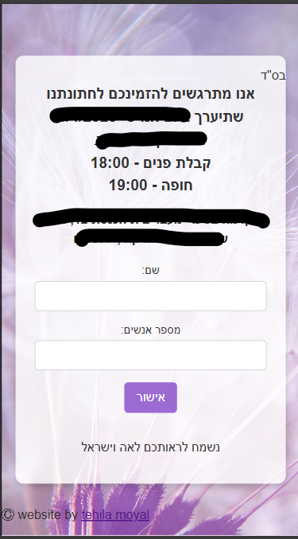
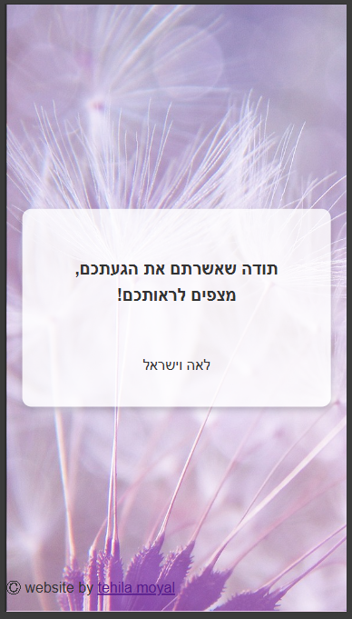
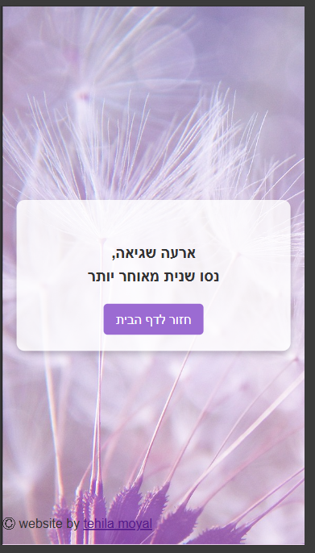

# Wedding RSVP Web App

This is a simple RSVP web application built using Node.js, EJS, and MySQL. Guests can submit their RSVP details online, which are then stored in a MySQL database for easy management.

---

## Features

- A responsive RSVP form styled for an elegant wedding invitation.
- User input fields include:
  - **Name**
  - **Number of attendees**
- Data is securely stored in a MySQL database.
- Guests are redirected to a thank-you page after submission.

---

## Technology Stack

- **Node.js**: Server-side JavaScript runtime.
- **Express.js**: Web framework for Node.js.
- **EJS**: Templating engine for rendering HTML with embedded JavaScript.
- **MySQL**: Relational database for storing RSVP data.
- **CSS**: Used for designing the front-end.

---

## Setup Instructions

### 1. Clone the Repository
```bash
git clone https://github.com/tehila-moyal/rsvp.git
cd rsvp-web-app
```

### 2. Install Dependencies
Make sure you have Node.js and npm installed. Then run:
```bash
npm install
```
## 3. add .env file 
add the env file with the environment variables:
```env 
export NODE_ENV='development'/'production'
export PORT=3000
```

### 4. Set Up MySQL Database
1. Open your MySQL client.
2. Run the following SQL commands to create the database and table:
```sql
CREATE DATABASE wedding_rsvp;

USE wedding_rsvp;

CREATE TABLE guests (
  id INT AUTO_INCREMENT PRIMARY KEY,
  name VARCHAR(100) NOT NULL,
  email VARCHAR(100) NOT NULL,
  attending ENUM('yes', 'no') NOT NULL,
  created_at TIMESTAMP DEFAULT CURRENT_TIMESTAMP
);
```
3. Update the database credentials in the .env file
```env 
export NODE_ENV='development'/'production'
export PORT=3000
export DB_USER='******'
export DB_PASS='******'
export DB_NAME='wedding_rsvp'
```


### 5. Start the Server
Run the following command to start the server:
```bash
npm start
```

### 6. Access the Web App
Open your browser and navigate to:
```
http://localhost:3000
```

---

## Project Structure
```
project/
├── public/             # Static files (CSS, images, etc.)
├── views/              # EJS templates
│   ├── index.ejs       # RSVP form page
│   ├── thank-you.ejs   # Thank-you page
├── app.js              # Main application file
├── package.json        # Project metadata and 
├── .env                # Environment Variables 
dependencies
└── README.md           # Project documentation
```

---

## Screenshots

### RSVP Form


### Thank You Page


### Error Page


---

## Future Enhancements
- Add email notifications to confirm RSVP submissions.
- Admin panel to view, edit, and export guest lists.
- Add support for multi-language invitations.

---


